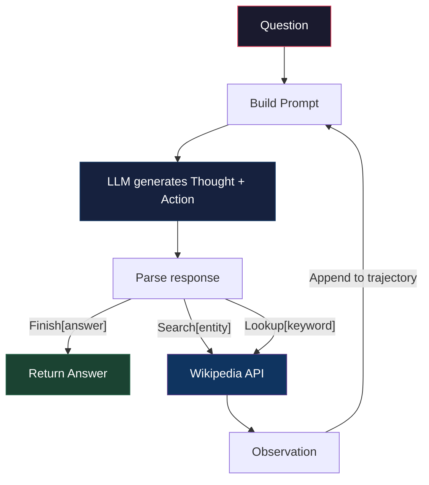

# 🧠 ReAct: Synergizing Reasoning and Acting in Language Models

> **A from-scratch implementation of [Yao et al., ICLR 2023](https://arxiv.org/abs/2210.03629)**
>
> *"I didn't just use LangChain — I understood why agents work by building the reasoning loop from scratch."*

## What is ReAct?

Most LLMs either **reason** (chain-of-thought) OR **act** (call tools). ReAct interleaves both:

```
Question: What is the capital of the country where the Cheli La pass is located?

Thought 1: I need to find which country the Cheli La pass is in, then find its capital.
Action 1:  Search[Cheli La pass]
Observe 1: Cheli La is a mountain pass in Bhutan, between Paro and Haa valleys...

Thought 2: Cheli La is in Bhutan. Now I need the capital of Bhutan.
Action 2:  Search[Bhutan]
Observe 2: Bhutan, officially the Kingdom of Bhutan, is a landlocked country...
           The capital and largest city is Thimphu.

Thought 3: The capital of Bhutan is Thimphu.
Action 3:  Finish[Thimphu] ✅
```

The model **thinks out loud, acts, observes, then thinks again** — dramatically reducing hallucination because it can verify beliefs through real tool calls.

## Architecture



**Key design decisions from the paper:**
- **Stop at "Observation:"** — the LLM must NOT generate observations. They come from real tool calls. This prevents hallucinated search results.
- **Few-shot prompting** — human-written example trajectories teach the model the Thought→Action→Observation pattern.
- **Stateful lookup** — `lookup` depends on the page found by `search`, forcing sequential planning.

## Quick Start

```bash
# 1. Clone and install
git clone <your-repo-url>
cd RE-ACT
pip install -r requirements.txt

# 2. Get a free API key from https://console.groq.com/
cp .env.example .env
# Edit .env and add your GROQ_API_KEY

# 3. Run a query
python -c "
from react_agent import ReactAgent
agent = ReactAgent()
answer, trace = agent.run('What is the capital of France?')
agent.print_trace()
"
```

## Evaluation

```bash
# HotpotQA — Multi-hop Question Answering
python -m eval.run_hotpotqa --n 5

# FEVER — Fact Verification
python -m eval.run_fever --n 5

# ReAct vs CoT vs Act-only (same subset)
python -m eval.compare_methods --task both --n 3
```

## Lightweight Tests

```bash
python -m unittest discover -s tests -v
```

## Project Structure

```
RE-ACT/
├── react_agent/
│   ├── agent.py          # The ReAct loop (Thought→Action→Observation)
│   ├── baselines.py      # CoT and Act-only baseline agents
│   ├── llm.py            # Thin LLM wrapper (Groq/OpenAI)
│   ├── parsing.py        # Response/action parsing helpers
│   ├── prompts.py        # Few-shot prompt templates
│   └── tools.py          # Wikipedia search/lookup environment
│
├── eval/
│   ├── compare_methods.py# ReAct vs CoT vs Act-only comparison runner
│   ├── run_hotpotqa.py   # HotpotQA evaluation
│   ├── run_fever.py      # FEVER evaluation
│   └── metrics.py        # EM, F1, accuracy
│
├── tests/
│   ├── test_metrics.py   # Unit tests for EM/F1/accuracy logic
│   └── test_parsing.py   # Unit tests for response parsing
│
└── notebooks/
    └── demo.ipynb        # Interactive walkthrough
```

## What I Learned

### 1. The stop sequence is everything
The single most important implementation detail: stopping LLM generation at `"Observation:"`. Without this, the model **invents** search results instead of actually searching. This is why ReAct reduces hallucination — it forces real-world grounding.

### 2. Prompt engineering IS systems design
The few-shot examples aren't just "prompts" — they define the agent's control flow. Each exemplar teaches a different reasoning strategy: decomposition, comparison, evidence gathering. Designing these is closer to writing an algorithm than writing a sentence.

### 3. Thoughts serve multiple roles
The paper's thoughts aren't generic "reasoning." They perform specific functions:
- **Decomposition**: "I need to find X, then use X to find Y"
- **Extraction**: "The observation says Z, which means..."
- **Tracking**: "I've found A and B, I still need C"
- **Judgment**: "This is enough evidence to conclude..."

### 4. The simplicity is the insight
ReAct uses just 3 tools (search, lookup, finish) and a simple prompt. No fine-tuning, no complex orchestration, no memory system. The insight is that **interleaving reasoning with action is itself sufficient** to dramatically improve agent performance.

## Paper Reference

```
@inproceedings{yao2023react,
  title={ReAct: Synergizing Reasoning and Acting in Language Models},
  author={Yao, Shunyu and Zhao, Jeffrey and Yu, Dian and Du, Nan and Shafran, Izhak and Narasimhan, Karthik and Cao, Yuan},
  booktitle={International Conference on Learning Representations (ICLR)},
  year={2023}
}
```

## Acknowledgments

- Paper: [ReAct: Synergizing Reasoning and Acting in Language Models](https://arxiv.org/abs/2210.03629)
- Official code: [ysymyth/ReAct](https://github.com/ysymyth/ReAct)
- LLM: [Groq](https://console.groq.com/) (free tier) + Meta's Llama 3.3 70B
