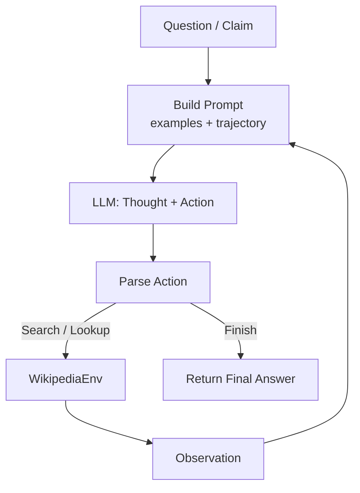
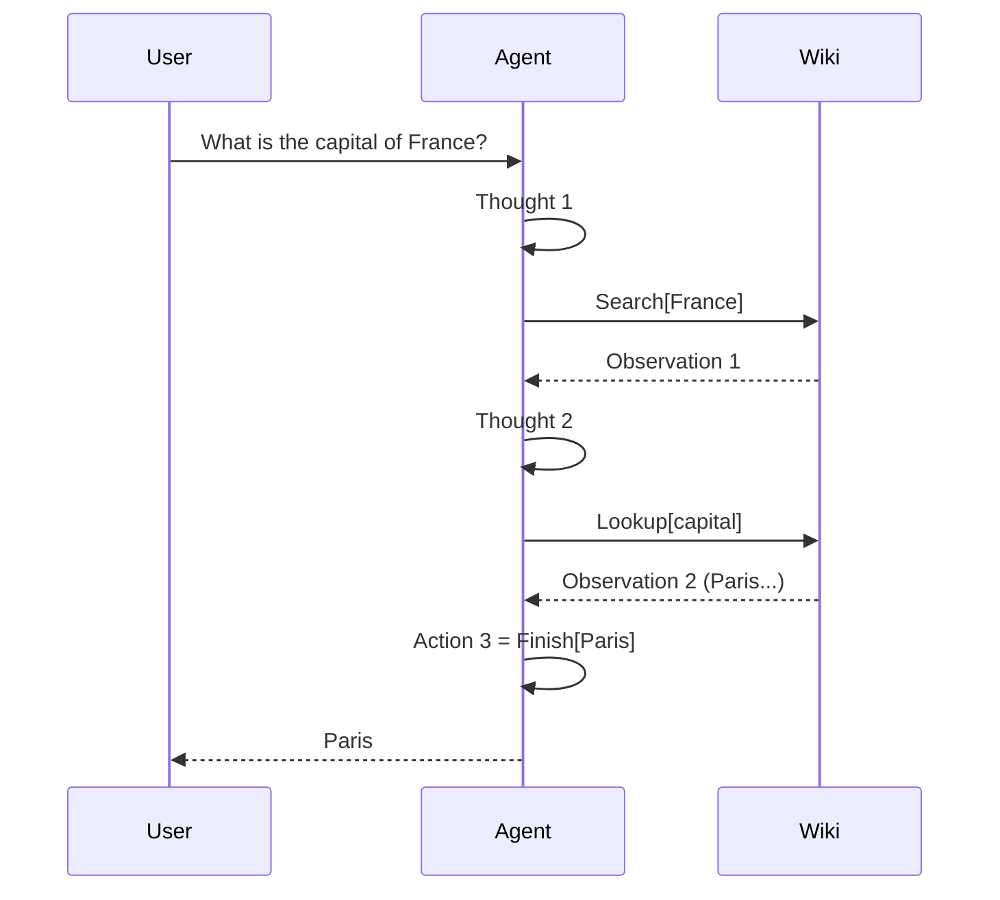

# ReAct Paper (ICLR 2023) - Simple From-Scratch Implementation

This repository is a simple educational implementation of:

**ReAct: Synergizing Reasoning and Acting in Language Models**  
https://arxiv.org/abs/2210.03629

Goal: understand the ReAct loop clearly, not build a production framework.

## What is implemented

- A minimal ReAct loop (`Thought -> Action -> Observation`)
- Three paper-style actions:
  - `Search[entity]`
  - `Lookup[keyword]`
  - `Finish[answer]`
- Few-shot prompts for:
  - HotpotQA-style multi-hop QA
  - FEVER-style fact verification
- Small evaluation scripts on curated subsets

## Visual 1: ReAct Loop



## Visual 2: Example Trajectory



## Project structure

```text
RE-ACT/
├── react_agent/
│   ├── agent.py      # core ReAct loop
│   ├── llm.py        # minimal LLM wrapper (Groq/OpenAI compatible)
│   ├── prompts.py    # few-shot prompt templates
│   ├── tools.py      # Wikipedia search + lookup environment
│   └── __init__.py
├── eval/
│   ├── metrics.py
│   ├── run_hotpotqa.py
│   ├── run_fever.py
│   └── __init__.py
├── notebooks/
│   └── demo.ipynb
├── requirements.txt
└── .env.example
```

## Setup

```bash
pip install -r requirements.txt
```

Create `.env` and set your key:

```env
GROQ_API_KEY=your_key_here
```

## Quick run

```bash
python -c "from react_agent import ReactAgent; a=ReactAgent(task='hotpotqa'); ans,trace=a.run('What is the capital of France?'); print(ans)"
```

If you want to see the full step-by-step reasoning trace:

```bash
python -c "from react_agent import ReactAgent; a=ReactAgent(task='hotpotqa'); ans,trace=a.run('What is the capital of France?'); a.print_trace()"
```

## Evaluation

```bash
python -m eval.run_hotpotqa --n 5
python -m eval.run_fever --n 5
```

## Notes about faithfulness

- This follows the paper's main idea: interleaving reasoning and tool use.
- It is intentionally small and readable for learning.
- It does **not** aim to exactly reproduce full benchmark numbers from the paper.

## References

- Paper: https://arxiv.org/abs/2210.03629
- Official code: https://github.com/ysymyth/ReAct
